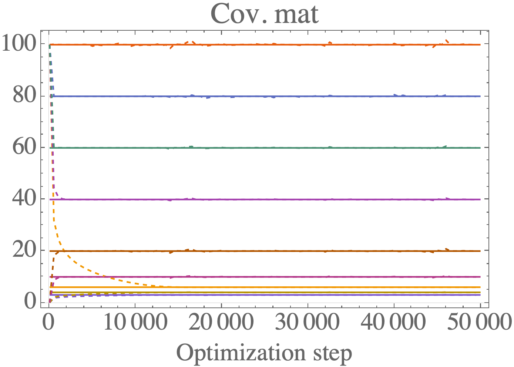
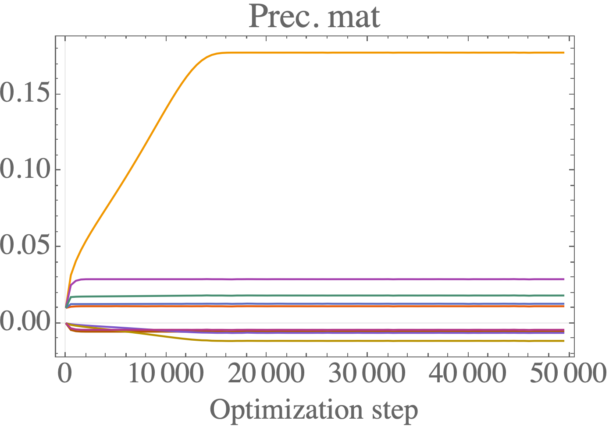

# Numerical inversion of precision matrix in Gaussian graphical model

## Summary

The goal of this library is to solve the problem of calculating the inverse of a symmetric positive definite matrix (e.g. a covariance matrix) when the constraints are mixed between the covariance matrix `\Sigma` and the precision matrix `B = \Sigma^{-1}`. In particular, constraints of the following form are considered:
```
\Sigma_{ij} = \theta_{ij}
B_{kl} = 0
```
where `\theta_{ij}` are some given numerical values. It is also considered that the number of constraints matches the number of degrees of freedom. An `N x N` symmetric matrix has `N + (N choose 2) = N * (N+1) / 2` degrees of freedom.

* If all the constraints were on `\Sigma`, this problem would be trivially solved by computing the inverse `B = \Sigma^{-1}`.
* For small matrices, this problem can be solved analytically - for large matrices this is infeasible.
* In this library, the problem is solved by optimization.

Convergence of the covariance matrix during optimization:


Convergence of the precision matrix during optimization:


## Building

Build out of a dedicated build directory;
```
mkdir build
cd build
cmake ..
make
make install
```

## Supported optimizers

Only first order methods (in the gradients) are included.

Two classes of optimizers are supported:
* Optimizers from the [Optim library](https://github.com/kthohr/optim).
* Several home-grown optimizers, including gradient descent (GD) and ADAM.